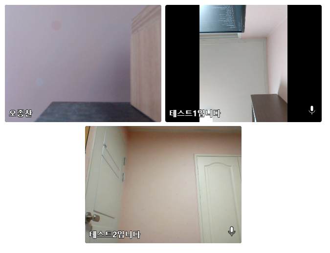
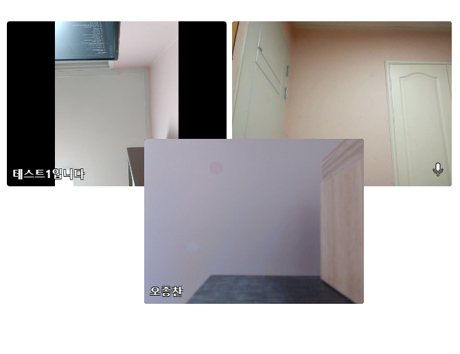
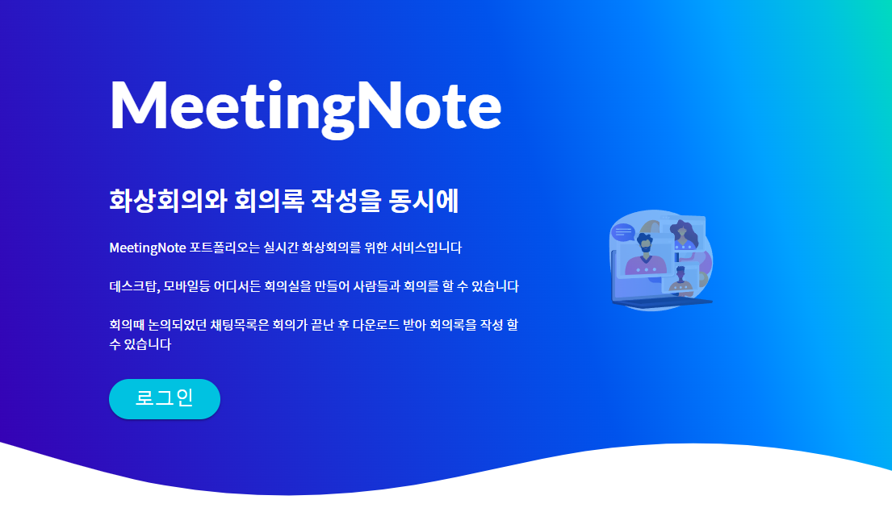
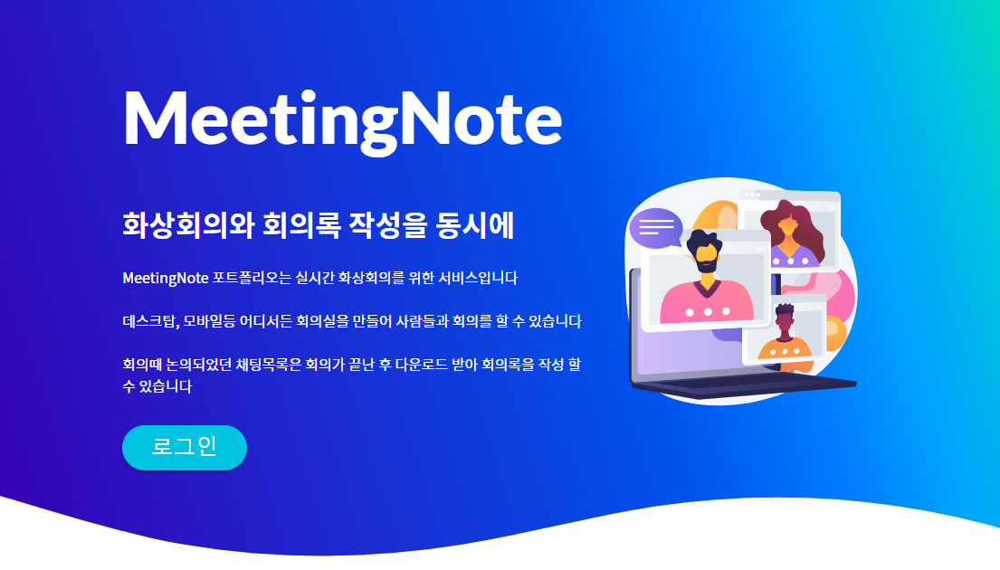
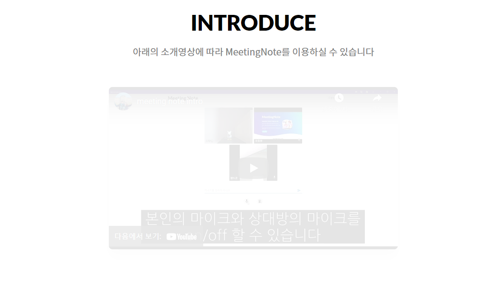
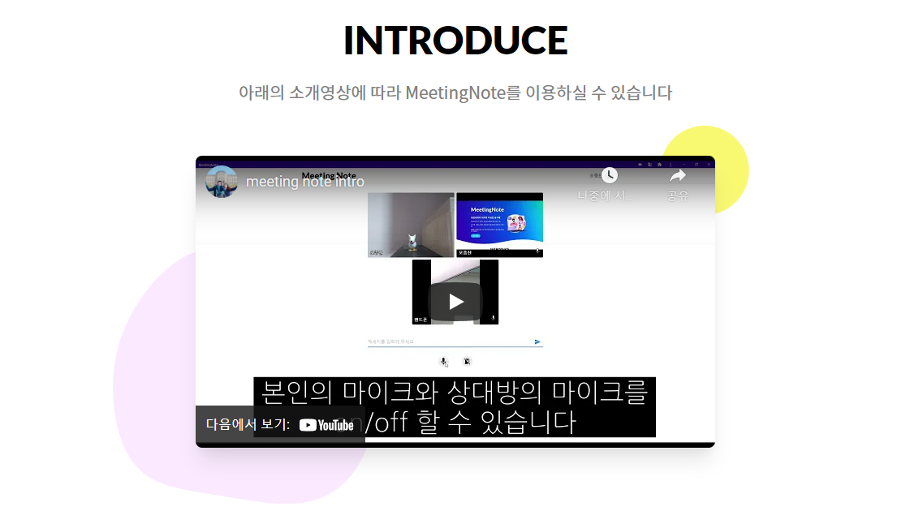

<h1 align="center">
  
   
  MeetingNote
   
</h1>
 

### React

- React를 이용하여 전체 페이지 제작
- Recoil 상태관리 라이브러리를 사용하여 로그인된 유저 정보 관리
- react-beautiful-dnd 라이브러리를 사용하여 화상회의 비디오 Drag & Drop 적용
- framer-motion 라이브러리를 사용하여 로고 애니메이션, 스크롤에 따른 opacity 애니메이션 적용
- MUI 라이브러리를 사용하여 Material 디자인 적용
- formic 라이브러리를 사용하여 form validation 적용
- i18next 라이브러리를 사용하여 다국어 지원
- CSS Module을 이용하여 스타일링
- 단락을 나누기 위해 SVG Shape divider 사용
- React-youtube 라이브러리를 이용하여 유튜브 동영상 재생

<table>
  <tr>
    <td>Drag & Drop</td>
    <td>
            
      
    </td>
  </tr>
  <tr>
    <td>로고 애니메이션</td>
    <td>
      
      
    </td>
  </tr>  
  <tr>
    <td>스크롤 애니메이션</td>
    <td>
      
      
    </td>
  </tr>  
</table>

---

### WebRTC

- WebRTC 기능을 이용하여 미디어 장치 제어
- WebRTC를 이용하여 최소한의 latency로 실시간 화상회의 가능

---

### Backend

- Node.js로 Signaling 서버 구현
- Websocket을 통해 각 프론트엔드와 통신
- 개인 Synology NAS에 https 서버 적용

---

### Firebase

- Firebase Auth를 이용해 로그인 및 인증 구현
- 회의실 목록, 채팅 목록 등은 Firestore Database로 관리

---

### PWA

- 편의성을 위해 PWA 적용
- 데스크탑, 모바일에서 앱처럼 사용 가능

---

 

[Abstract 벡터는 vectorjuice - kr.freepik.com가 제작함](https://kr.freepik.com/vectors/abstract)
